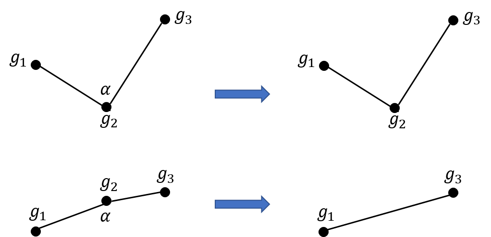

# Rutes i Monuments

## Taula de continguts
0. [Visió General](#visió-general)
1. [Instal·lació](#instal·lació)
2. [Ús](#ús)
3. [Característiques i funcionament](#característiques-i-funcionament)
4. [Mòduls](#mòduls)
5. [Arquitectura de l'aplicació](#arquitectura-de-laplicació)
6. [Decisions de disseny](#decisions-de-disseny)
7. [Tractament d'errors](#tractament-derrors)
8. [Autors](#autors)

## Visió General
El projecte Rutes i Monuments té com a objectiu inferir mapes a partir de trajectòries GPS obtingudes per senderistes  per tal de trobar rutes òptimes per arribar a les edificacions medievals de Catalunya més properes a l'usuari, i permetre'n la visualització resultats.


## Instal·lació
Per a la instal·lació del projecte, cal descarregar el programa i preparar els requeriments necessaris. Els passos son els següents:

1. Accedir al directori del projecte:
    ```bash
    cd rutes-i-monuments
    ```
2. Instalar les dependències necessàries fent:
    ```bash
    pip install -r requirements.txt
    ```

## Ús
Per tal d'usar el programa proporcionat, cal que executar la següent comanda a la terminal (des del directori del programa).

Comanda per iniciar el programa:
    ```
    python3 main.py
    ```

## Característiques i funcionament

### Característiques

El projecte **Rutes i Monuments** és una aplicació que permet generar i gestionar rutes turístiques que inclouen segments de camí i punts d'interès com monuments i edificacions medievals. L'aplicació permet:

- Obtenir les rutes dels senderistes en una regió geogràfica.
- Inferir un mapa (un graf) a partir de les rutes.
- Veure el resultat del clustering per triar les arestes del graf
- Obtenir tots els monuments del web Catalunya medieval
- Trobar les rutes òptimes per arribar a aquests monuments
- Visualitzar tots aquests resultats en mapes 2D i 3D


### Funcionament

Aquest programa presenta una interfície a la terminal que demana a l'usuari unes dades inicials:
- nom de projecte
- localiltzació (pot ser exacta o no)

El procediment del programa son les següents donat un box (calculat a partir d'un punt inicial) i una localitació inicial:
- Obtenir tots els segments dins del box.
- Inferir un graf dels segments, simplificar-lo i generar-ne un mapa *.
- Descarregar i filtrar els monuments i edificacions medievals de Catalunya situats dins del box.
- Assignar cadascun d'aquests monuments al seu node més proper
- Calcular les distàncies en el graf des del punt inicial a cadascun dels monuments
- Oferir un mapa final que mostra els camins més curts fins a cada monument des del punt inicial.

*(Tots els mapes es guarden en png i en format kml)

Durant el funcionament del programa, s'aniran guardant els resultats dels mapes i fitxers generats amb les dades del projecte; a més, la interfície demanarà a l'usuari si vol visualitzar cadascun per pantalla a mida que es vagin generant.

A més, s'inclou un fitxer `clustering_view.py` que no forma part del programa principal però permet veure com es defineixen els nodes del graf (centroides) a partir dels punts geogràfics usant l'algorisme de clustering kmeans.

## Mòduls
El projecte està dividit en diversos mòduls, cadascun amb una responsabilitat específica. A continuació es fa una explicació detallada de cadascun dels mòduls i la seva funció.

### segments.py
L'arxiu `segments.py` s'encarrega de descarregar les diferents rutes que es trobin dins d'unes coordenades determinades, obtenint la informació proporcionada per la pagina web de Wikiloc. 

Aquestes son emmagatzemades en un fitxer csv anomenat `{filename}_segments.csv`, contenint la següent informació:

*segment_id, inici_lat, inici_long, t_inici, final_lat, final_long, t_final, track_id*

A més, abans de guardar cada segments en fa un filtratge. Filtra els segments comprovant que el punt inicial i el punt final de cadascun no siguin separats per una distancia excessiva; d'aquesta manera s'eliminen possibles segments erronis o que s'hagin registrat malament.

Finalment, també consta d'una funció que crea una mapa png anomenat `segments_map.png` on es poden visualitzar totes les rutes sobre un mapa en 2D.


### graphmaker.py
El mòdul `graphmaker.py` és l'encarregat d'inferir el graf a partir dels segments ja recollits. El procediment seguit per crear el graf és el següent:

L'arxiu  crea una llista de centroides a partir de `{filename}_segments.csv` i afegeix una columna a aquest últim on a cada segment li assigna un centroide (*cluster_id*).

A continuació, identifica quins nodes (clusters) estan connectats entre ells donat que els dos punts que conformen un segment (punt d'inici i punt final) pertanyin a 2 clusters diferents, imposant que estaran connectats si això es dona per un nombre de segments determinat per la constant `Min_ways`.

A partir de la informació obtenida, crea un graf amb `N_clusters` on els centroides son els nodes i contenen *location* (coordenades) i *monuments* (els monuments que són a prop d'aquest centroide; aquest camp és buit quan el graf s'acaba de crear) i les arestes son les connexions entre aquests, contenint *weight* (distància entre nodes).

Per últim, simplifica el graf, eliminant tots els nodes que no tinguin cap aresta o aquests que només tinguin 2 veïns i formin un angle proper a 180, (180 ± `Epsilon`).




### monuments.py
L'arxiu `monuments.py` descarrega els monuments de tota Catalunya accedint al codi html de la web Catalunya Medieval i els emmagatzema a un fitxer csv `monuments.csv`, que conté la següent informació de cada monument:

*name, lat, lon*

També s'encarrega de filtrar els monuments i retornar únicament els que es troben dins d'unes coordenades concretes.

Per obtenir els monuments d'una zona concreta, filtrarà el fitxer ja existent de tots els monuments. Tot i això, també es pot demanar que abans de filtrar-los els torni a descarregar (obtenint-ne així possibles actualitzacions)


### viewer.py
El mòdul `viewer.py` s'encarrega de crear els quatre tipus de mapes diferents, guardar-los i mostrar-los en pantalla (si ho desitja l'usuari).

El primer es un mapa PNG en 2D contenint el graf de les rutes simplificades, amb nodes i arestes, vermelles i blaves respectivament.

El segon es un mapa KML en 3D on es mostra el graf simplificat, cada node conté la seva posició geogràfica i les arestes marquen les connexion entre aquests.

El tercer es un mapa KML en 3D creat a partir d'un arbre, on els nodes als que s'aproximen els monuments son de color vermell, contenen el nom d'aquests i la distància total des del punt d'origen (punt blau)

El quart es un mapa PNG en 2D creat a partir d'un arbre, on el punt d'origen es blau, els nodes on n'hi ha monuments destaquen en vermell, el monuments en si son petits punts liles i la resta de graf es negre (nodes sense cap informació i arestes). Es pot activar segons vulgui l'usuari poder veure els monuments en el mapa o no.


### routes.py
El mòdul `routes.py` te la finalitat de crear el graf que tindrà tota la informació necessaria: node d'inici, nodes amb monuments, distàncies i arestes.

Per a cada coordenada, ja sigui la d'un monument o la del punt inicial, hi troba el node mes proper i emmagatzema aquesta informació. 

Seguidament hi busca la ruta mes curta des d'aquest node incial ("start") fins a tots els altres nodes del graf, seguint un algoristme de dijkstra.

Per últim, crea un altre graf ("routes_tree") que conté únicament els nodes rellevants (start, monuments o nodes que pertanyen al camí) on les arestes indiquen la ruta més curta entre l'origen i els nodes amb monuments.

A més, en aquest graf resultant cada node que té monuments associats conté la informació de:
* Llistat de monuments
* Distància en km del camí més curt des de l'origen
* Identificadors (i ordre) dels nodes pels que passa el camí més curt
* Localització geogràfica d'aquell node (Aquesta informació la tenen tots els nodes)


### main.py
`main.py` és el punt d'entrada del programa. Coordina les crides a les funcions dels altres mòduls per generar les rutes i gestionar els monuments.

Les instruccions i presentació fetes a l'inici del programa principal estan en el fitxer `introduccio.txt` que es pot trobar en el directori del programa. A més. consta de funcions per obtenir les dades per inicialitzar el programa.

Comença llegint les dades, l'usuari pot triar entre donar unes coordenades exactes o el nom d'una localització, de la qual el programa s'encarregarà de trobar les coordenades amb el mòdul `geopy`. A continuació demana un radi, que indica la mitja diagonal d'un quadrat, del qual en calcularà els límits d'un box. És a dir, la distància màxima a la que s'arribarà des del punt inicial.

Després d'introduir el nom del projecte desitjat, fa crides als altres mòduls per a realitzar totes les accions necessaries i crear tots els outputs desitjats contenint el nom introduit anteriorment.

## Arquitectura de l'aplicació
No es presenta l'esquema en forma de graf dirigit de com accedeixen els mòduls entre ells ja que és un graf molt complex. Tot i això l'arquitectura de l'aplicació és la següent.

El programa prinicipal funciona des del main; que accedeix a les funcionalitats de cadascun dels mòduls. A partir d'aquí, pot ser que els mòduls diferents al principal accedeixin entre ells; sobretot per usar els tipus d'objectes generats i seguir amb la uniformitat de tipus.

## Decisions de disseny
En aquest projecte, s'han pres les següents decisions de disseny per tal de garantir una estructura clara i funcional:

1. **Modularitat**: El projecte es divideix en diversos arxius, cadascun amb una responsabilitat específica. Això facilita el manteniment i la extensibilitat del codi.
2. **Ús de grafs**: Per representar les rutes i segments, s'ha optat per utilitzar grafs, ja que permeten gestionar i optimitzar rutes de manera eficient. D'aquesta manera es redueix l'excessiu nombre de punts gepogràfics donat per una ruta GPS.
3. **Ús de Dataframes**
L'ús d'aquest tipus d'objecte facilita poder accedir a les dades, tant a l'hora d'iterar en elles, com per poder emmagatzemar informació extra per a cada unitat desitjada. 
Aquesta implementació permet un codi molt més net, entendible i pot ser beneficiós de cara a la futura millora del projecte a l'hora de guardar categories addicionals d'informació associades a cada segment, monument, etc.

4. **Programació basada en objectes i elecció de tipus**
Per tal de fer el codi més entendible i organitzat (donat el gran nombre d'objectes a classificar en un projecte així) s'ha decidit assignar a cada objecte del programa un tipus a través d'alias i estructures de dades: 
- Punt
- Box
- Segments
- Aresta
- Monument i Monuments
- Rutes

    Usant aquests tipus, cadascun dels tipus es pot definir usant una combinació dels anteriors. Gràcies a això es poden emmagatzemar i accedir a les dades de forma molt uniforme

5. **Interfície de línia de comandes**: S'ha decidit començar amb una interfície de línia de comandes per a la interacció inicial amb l'usuari, ja que simplifica el desenvolupament i les proves inicials. Tot i això, s'ha optat per demanar el mínim nombre d'instruccions inicials, que s'han vist reduïdes a:
* Ubicació inicial (Ja sigui en coordenades o una zona a buscar) 
* Distància màxima (Usada per generar el box.)
* Nom del projecte (per posar nom als fitxers generats)

    Això es deu a que a l'hora d'interactuar amb el programa serà molt més natural generar el box a partir d'una distància donada que demanar a un usuari les coordenades del box. 
    A més, d'aquesta manera es situa el punt inicial just al centre; per tal de poder arribar al màxim de monuments de manera uniforme.

6. **Generació de resultats**: Els arxius que contenen dades (rutes i monuments) estan separats de la lògica del programa, la qual cosa millora la llegibilitat i organització del codi.

7. **Reutilització de codi**: S'han creat funcions reutilitzables per operacions comunes com el càlcul de distàncies o constants donades o bé l'assignació de punts geogràfics a nodes, la qual cosa redueix la duplicació de codi i facilita les modificacions futures.

8. **Afegir arestes al graf**
Per tal d'esquivar incorrecteses de les dades, s'ha afegit una constant que determina el mínim nombre de segments que han de connectar dos nodes per tal que una aresta existeixi. D'aquesta manera el programa s'assegura que és un camí que ha estat minimament transitat i no ha sigut un sender erroni o un error de localització.


### Constants
A continuació es mostren les diferents constants que afecten al funcionament del programa, separades per mòdul
- **segments**:
    - **Delta**: És la distància màxima que pot haver-hi entre el punt inicial i final d'un segment. Si aquesta distància és superada, el segment no serà desat.
- **graphmaker**:
    - **N_clusters**: Nombre de clusters, és a dir, el nombre de nodes que tidrà el graf inferit..
    - **Dmax_edge**: Distància màxima entre dues arestes del graf, de ser superior; l'aresta no es generarà.
    - **Min_ways** Aquesta variable és el mínim nombre de segments que han de connectar 2 nodes per tal que es materialitzi l'aresta. Aquest paràmetre dependrà del nombre total de segments en la zona per adaptar-se a cada projecte.
    - **Epsilon**
    Grau a partir del que un node serà simplificat; i substituit per una aresta.

## Tractament d'errors
Aquest projecte consta d'una exhaustiu tractament d'errors per tal que si una funció conté un paràmetre d'entrada a partir del qual no podrà funcionar com és esperat, l'execució del codi pari, mostrant així per pantalla la causa de l'error.

- Error al obtenir una localització inicial
- Visualitzar un conjunt de segments buit
- Inferir un graf sobre un conjunt de segments buit
- Exportar un graf o arbre buit
- Cap monument dins del box

A més, si el programa para la seva execució en un punt, aquest ja no continuarà, evitant així errors futurs.

### Errors de tipus
Per tal de comprovar els errors de tipus s'ha usat l'eina mypy. Compte!! cal fer :
```
mypy --install-types
```
per tal que mypy accepti els tipus de les llibreries no estandard usades.

Apunt: tot i això mypy segueix sense reconèixer els tipus d'algunes llibreries.

## Autors
Aquest projecte de rutes i monuments ha estat creat per Jordi Corbalan Vilaplana i Nicolás Jimenez Muñoz, estudiants del grau en Ciència i Enginyeria de Dades a la UPC part de l'assignatura Algorísmia i Programació 2. L'especificació i enunciat del treball es pot trobar a https://github.com/jordi-petit/ap2-rutes-i-monuments-2024